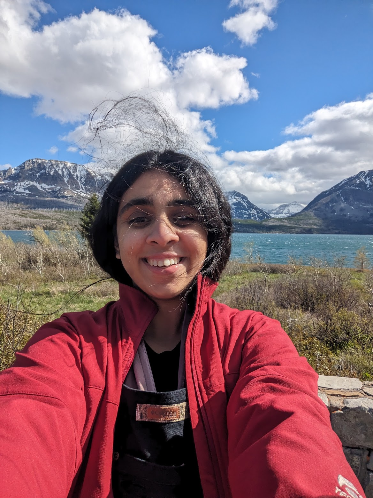

*CS PhD Student · Northeastern University*

## Updates

- **[April 2026]** Gave a talk for the Khoury Student Seminar. Slides [here](https://drive.google.com/file/d/1KubcfVxNnuPQxWZh9Qzzi9jUp9BpXFNC/view?usp=sharing).
- **[March 2026]** [Chain of Thought Steering](https://openreview.net/forum?id=v0XkjgeD6U&referrer=%5Bthe%20profile%20of%20Ananya%20Malik%5D(%2Fprofile%3Fid%3D~Ananya_Malik1)) accepted to the Logical Reasoning Workshop @ ICLR 2026.
- **[January 2026]** New essay on Substack: [LLM Systems: An Untapped Lever for AI Safety](https://ananyamalikk.substack.com/p/llm-systems-an-untapped-lever-for).
- **[August 2025]** Two papers accepted to EMNLP Findings 2025.
- **[July 2025]** Selected as a fellow/mentee for [MARS](https://www.cambridgeaisafety.org/mars).
- **[December 2024]** [Cultural robustness paper](https://arxiv.org/abs/2410.20490) accepted at SafeGenAI Workshop @ NeurIPS 2024.
- **[September 2024]** Started PhD at Northeastern University.
- **[August 2023]** Joined Amazon as a Software Development Engineer ([ASCS](https://www.amazon.jobs/content/en/teams/e-commerce-foundation/ascs)).
- **[February 2023]** Joined [CLAWS Lab](https://faculty.cc.gatech.edu/~srijan/) at Georgia Tech as researcher and data engineer.
- **[December 2022]** Graduated with MS CS from Georgia Tech.

## About

I am a second-year Computer Science PhD student at Northeastern University's [Khoury College of Computer Science](https://www.khoury.northeastern.edu/), advised by [Prof. Mai ElSherief](https://www.maielsherief.com/).

**Summer 2026:** Applied Research Intern at Adobe, working on latency optimization with Arko Mukherjee, Junxuan Li, and Subhojyoti Mukherjee.

Previously, I was a Software Engineer at Amazon (Seattle) in the [Selection Monitoring and Catalog Systems](https://www.amazon.jobs/content/en/teams/e-commerce-foundation/ascs) team. I hold an MS in CS from [Georgia Tech](https://www.gatech.edu/), where I conducted research with [Prof. Srijan Kumar](https://faculty.cc.gatech.edu/~srijan/) in the CLAWS Lab. I also serve as a research mentor at [SimPPL](https://simppl.org/).

## Research Interests

I design AI systems that are safer, more controllable, and socially and cognitively aligned.

### Persona Representation & Personalization

- **Human Personas:** Investigating how models internalize human traits mechanistically and behaviorally, using latent subspaces for precise behavioral control.
- **User Context:** Evaluating how demographics, [dialect](https://arxiv.org/abs/2410.20490), and identity affect model behavior and [empathy variation](https://arxiv.org/pdf/2510.10328).
- **World Maps:** Studying how geographic and spatial knowledge is structured within model weights.

### Cognitive & Social Alignment

- **Cognitive-Inspired LLMs:** Grounding model architecture and optimization in human cognition to improve reasoning and complex problem-solving.
- **Inference-Time Steering:** Using activation patching and causal mediation analysis to mitigate bias and modulate behavior without retraining.
- **Robust Reasoning:** Developing lightweight interventions to ensure [consistent, human-aligned chain-of-thought processes](https://openreview.net/forum?id=v0XkjgeD6U&referrer=%5Bthe%20profile%20of%20Ananya%20Malik%5D(%2Fprofile%3Fid%3D~Ananya_Malik1)).

### Computational Social Science & Safety

- **Healthy Communities:** Developing NLP tools to detect nuanced online phenomena such as [dog whistles](https://drive.google.com/file/d/1hYIJjy92jo9VgBmfIY3AZTr-KUbr0dTa/view) and [hate speech reasoning](https://ananyamalikk.substack.com/p/intent-to-hate).
- **Behavioral Detection:** Identifying and neutralizing adversarial and harmful social behaviors in LLMs.
- **Intent Analysis:** Applying optimized prompts to analyze social trends, including digital expressions of [motherhood burnout](https://arxiv.org/abs/2602.07781).

---

## Publications

  <h3>Publications</h3>
  <select id="filter-year" class="filter-select">
    <option value="all">All Years</option>
    <option value="2025">2025</option>
    <option value="2024">2024</option>
    <option value="2023">2023</option>
    <option value="2021">2021</option>
    <option value="2020">2020</option>
  </select>
  <select id="filter-conference" class="filter-select">
    <option value="all">All Venues</option>
    <option value="Conference">Conference</option>
    <option value="Workshop">Workshop</option>
    <option value="Journal">Journal</option>
    <option value="Pre-print">Pre-print</option>
  </select>

  2025
  EMNLP Findings 2025

<strong>Malik, Ananya</strong>, Nazanin Sabri, Melissa Karnaze, and Mai Elsherief. <em>Are LLMs Empathetic to All? Investigating the Influence of Multi-Demographic Personas on a Model's Empathy.</em> <a href="https://aclanthology.org/2025.findings-emnlp.1358/">Paper</a>

  2025
  EMNLP Findings 2025
  NeurIPS SafeGenAI Workshop — Oral

<strong>Malik, Ananya</strong>, Sharma, Kartik, Ng Lynette Hui Xian, Bhatt, Shaily. <em>Who Speaks Matters: Analysing the Influence of the Speaker's Ethnicity on Hate Classification.</em> <a href="https://aclanthology.org/2025.findings-emnlp.1357/">Paper</a>

  2023
  Pre-print

<strong>Malik, Ananya</strong>. <em>Evaluating Large Language Models through Gender and Racial Stereotypes.</em> <a href="https://arxiv.org/pdf/2311.14788">Paper</a>

  2021
  ITM Web Conference

Amogh Parab, <strong>Ananya Malik</strong>, Arish Damania, Arnav Parekhji. <em>Successive Image Generation from a Single Sentence.</em> <a href="https://www.itm-conferences.org/articles/itmconf/abs/2021/05/itmconf_icacc2021_03017/itmconf_icacc2021_03017.html">Paper</a>

  2021
  Elsevier

<strong>A. Malik</strong>, Y. Javeri, M. Shah, R. Mangrulkar. <em>Impact Analysis of Covid-19 News Headlines on Global Economy.</em> Cyber-Physical Systems for COVID-19, Elsevier. <a href="https://www.sciencedirect.com/science/article/abs/pii/B9780128245576000017">Paper</a>

  2020
  IJCA

<strong>A. Malik</strong>. <em>Survey paper on applications of generative adversarial networks in the field of social media.</em> <a href="https://d1wqtxts1xzle7.cloudfront.net/93533194/ijca2020920728-libre.pdf">Paper</a>

---

## Academic Service

### Affiliations

- **NEU:** [CSG (Computation for Social Good) Lab](https://www.maielsherief.com/)
- [Geodesic Research](https://www.geodesicresearch.org/) &middot; [MAIA](https://aialignment.mit.edu/) &middot; [SimPPL](https://simppl.org/) &middot; [CLAWS, Georgia Tech](https://faculty.cc.gatech.edu/~srijan/)

### Teaching

- **NEU:** [CS 5200: Database Management Systems](https://www.khoury.northeastern.edu/people/martin-schedlbauer/) &middot; [CS 4100: Foundations of AI](https://www.khoury.northeastern.edu/home/camato/4100summaryS25.html) (Spring 2025)
- **Georgia Tech:** CS 3600: Introduction to AI (Spring/Fall 2022)

### Talks & Presentations

- [Advanced Topics in AI](https://www.canva.com/design/DAGjgwNOPBE/Z09A59smG8vXAGvgaW7PFA/view) — Guest Lecture (Slides)
- [Who Speaks Matters: Analysing the Influence of the Speaker's Ethnicity on Hate Classification](https://neurips.cc/virtual/2024/workshop/84705#wse-detail-109375) — NeurIPS SafeGenAI Workshop (Presentation & Slides)