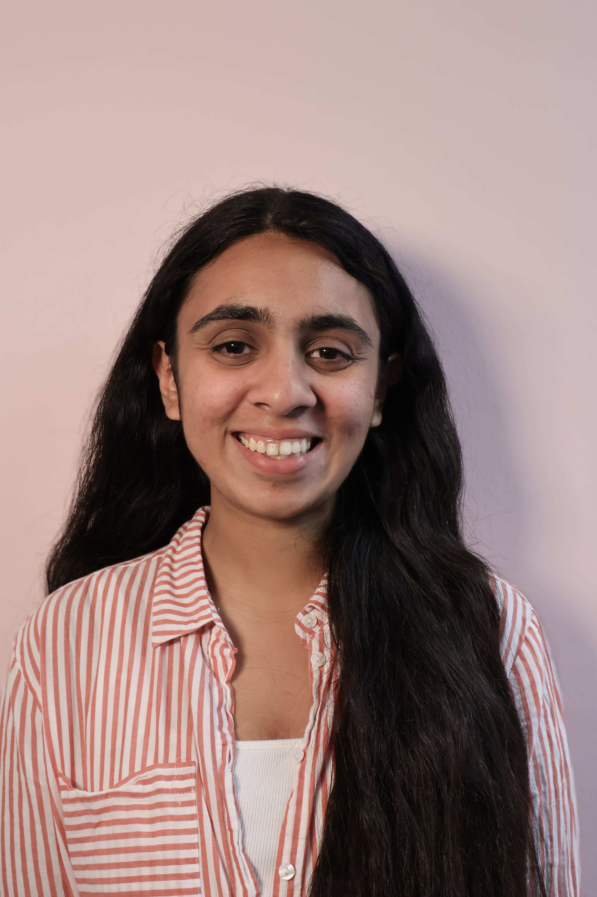

## About Me

I am a first year CS PhD student at [Khoury College of Computer Science](https://www.khoury.northeastern.edu/) at Northeastern University in Boston. I am advised by Prof [Mai ElSherief](https://www.maielsherief.com/). 

Before starting my PhD, I was a Software Engineer with the [Selection Monitoring and Catalog Systems](https://www.amazon.jobs/content/en/teams/e-commerce-foundation/ascs) organization at Amazon in Seattle. Prior to that I was an MS CS student at [Georgia Tech](https://www.gatech.edu/). At Georgia Tech, I was advised by Prof [Srijan Kumar](https://faculty.cc.gatech.edu/~srijan/) in the CLAWS Lab. I also dabble as a Research mentor with [SimPPL](https://simppl.org/).

## Research Interest

I am focused on understanding, evaluating, and aligning AI for social good and downstream applications. My work, primarily centered around NLP, can be broadly categorized into the following areas:

1. Value Based Alignment  :

*How do models align to humans in context of value-based artifacts?*

In pursuit of this, I have studied how dialectal features added as a form of implicit identity for a culture can expose systemic biases of an LLM [(SafeGenAI Oral Presentation @ NeurIPS'24)](https://arxiv.org/abs/2410.20490), and have studied how LLMs interpret different [genders and races when viewed as professions](https://arxiv.org/pdf/2311.14788).My current work focusses on evaluating models on a value based axis using tasks as emotional intelligence. [In submission at COLM'25]

Methadologically, using Value Based Alignment as a proposition, my work explores the addition of a user's persona to the LLM's context.

2. Understanding and Analyzing for Social Good Applications: 

*How can we understand and support the well-being of online communities?*

I am interested in leveraging AI capabilities for understanding how communities --  specifically those cultivated online function. I have worked in understanding how misinformation can be countered using field studies on Twitter (now X). I have analysed [hate speech categories and reasoning](https://ananyamalikk.substack.com/p/intent-to-hate) and worked on a report classifying [dog whistles on social media](https://drive.google.com/file/d/1hYIJjy92jo9VgBmfIY3AZTr-KUbr0dTa/view).  

## Updates

- **[December 2024]** Our paper on [evaluating models for cultural robustness in hate speech detection](https://arxiv.org/abs/2410.20490) accepted as an oral presentation at the SafeGenAI at NeurIPS!
- **[September 2024]** Started my PhD at Northeastern University
- **[January 2024]** Volunteering as a research Mentor at [SimPPL](https://simppl.org/)
- **[August 2023]** Started working as a Software Develpoment Engineer at [ASCS @ Amazon](https://www.amazon.jobs/content/en/teams/e-commerce-foundation/ascs)
- **[February 2023]** Started as a full-time researcher and data engineer at [CLAWS Lab](https://faculty.cc.gatech.edu/~srijan/), Georgia Tech
- **[December 2022]** Graduated with MS CS from Georgia Tech

## Publications

- Malik, Ananya; Sharma, Kartik; Ng Lynette Hui Xian; Bhatt, Shaily ”Who Speaks Matters: Analysing the Influence
of the Speaker’s Ethnicity on Hate Classification.” Accepted to NeurIPS SafeGenAI 2024 (Oral Presentation)
- Malik, Ananya. ”Evaluating Large Language Models through Gender and Racial Stereotypes.” arXiv preprint
arXiv:2311.14788 (2023).
- Successive Image Generation from a Single Sentence, Amogh Parab, Ananya Malik, Arish Damania, Arnav Parekhji,
Pranit Bari, ITM Web Conf. 40 03017 (2021), DOI: 10.1051/itmconf/20214003017.
- A.Malik, Y. Javeri, M. Shah, R. Mangrulkar, ‘Impact Analysis of Covid 19 News Headlines on Global Economy’,
Cyber-Physical Systems for COVID-19, Elsevier.
- Malik A. Survey paper on applications of generative adversarial networks in the field of social media. Int J Comput
Appl (IJCA). 2020;175(20):13–18. doi:10.5120/ijca2020920728

## Academic Service

Teaching

-  TA for [CS 4100: Foundations of AI (Spring 2025)](https://www.khoury.northeastern.edu/home/camato/4100summaryS25.html) with Prof Chris Amato

- TA for CS 3600: Intro to AI, with Prof James Rehg (Spring 2022) and Prof Mark Reidl (Fall 2022)

Talks

- [Slides](https://www.canva.com/design/DAGjgwNOPBE/Z09A59smG8vXAGvgaW7PFA/view?utm_content=DAGjgwNOPBE&utm_campaign=designshare&utm_medium=link2&utm_source=uniquelinks&utlId=h7faf8a8774) of my lecture on Advanced Topics in AI

- Presentation and Slides at SafeGenAI workship at NeurIPS on [Who Speaks Matters: Analysing the Influence of the Speaker’s Ethnicity on Hate Classification](https://neurips.cc/virtual/2024/workshop/84705#wse-detail-109375)

